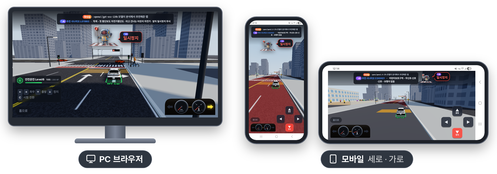
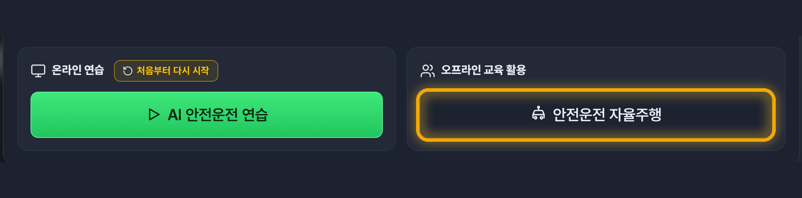

<h1>
  <picture>
    <source media="(prefers-color-scheme: dark)" srcset="docs/title-dark.png">
    
  </picture>
</h1>

이 프로그램은 교통법규 중 지키기 힘든 부분을 **AI의 도움을 받아서 훈련을 하는 프로그램**입니다.

아빠 차를 타며 헷갈리는 상황들을 많이 봤었습니다. 그리고 AI를 활용해서 훈련하는 곳을 만들면 많은 사람들이 교통법규도 잘 지키고 안전하게 운전을 할 수 있을 것 같아서 만들게 되었습니다.

AI를 통해서 안전한 도로가 되었으면 좋겠습니다. 아래 주소로 접속해서 안전운전을 연습해봐요.\
https://safeturn.vercel.app

---

## 1. 개요

### ① AI 우회전 참교육의 필요성

### ② 우회전 · 어린이보호구역에 AI가 필요한 이유

---

## 2. AI 우회전 참교육 내용

다양한 플랫폼에서 AI가 운전 습관을 개선해 줍니다.

### ① PC와 모바일 모두 지원

  

AI 우회전 참교육은 **PC와 모바일환경을 지원**합니다.
- PC — 키보드 방향키로 운전합니다
- 모바일 — 화면의 화살표 버튼으로 운전합니다 (세로 · 가로 모두)
- 설치 없이 웹 주소 하나로 접속합니다

### ② 안전운전 연습과 AI 분석 시작

안전운전 연습을 누르면 **AI가 분석을 시작**합니다.
- 첫 화면에 녹색 운전 연습 버튼을 누르면 시작합니다.
- 레벨 · 경험치를 주어 성취감을 높입니다.
- AI가 기록한 나쁜 운전 습관을 보여줍니다.

### ③ 운전 습관 분석과 코스 범위 — 1단계 · 도로교통법 판정 프로그램

AI가 광범위한 분석을 하면 **할루시네이션**으로 정확한 시나리오 제시 확률이 떨어집니다.\
도로교통법 판정 프로그램으로 전체 시나리오 8,958개 중에서 우선 선별을 합니다.
- 도로교통법 판정 프로그램이 위반을 나쁜 습관으로 기록합니다
- 8,958개 중 그 습관을 시험하는 후보를 좁힙니다.
- 법규는 규칙으로 정확하게 — 틀린 맵이 나오는 확률을 줄입니다.

### ④ 운전자에게 맞는 맵 추천 — 2단계 · 생성형 AI

**AI 우회전이 운전 습관을 분석**하여 운전자에게 맞는 최종 시나리오를 골라 주고, 추천 사유와 주행 내용을 미리 알려줍니다.
- Gemini, Groq에서 gemini, gpt-oss 등 다양한 AI 모델이 운전자의 운전 습관을 고려하여 최종 선택을 합니다.
- 운전자의 고칠 습관(최근 주행 · 준수율 · 위험도 판단)과 맵 · 추천 사유를 알려줍니다.

### ⑤ 말풍선으로 주는 안전 안내

AI 우회전이 중간중간 나와서 **말풍선으로 안전에 맞는 안내**를 해줍니다.
- 일시정지 · 보행자 통행 확인 · 서행 진행 · 신호 대기
- 속도와 깜빡이는 우회전과 일시정지에 집중하기 위해 자동으로 동작합니다.

### ⑥ 보행자 느낌표와 바닥 색 표시

건너려는 보행자 **머리 위에 느낌표가 뜨고, 바닥에 녹색, 노란색 등으로 표현**하여 안전 운전을 돕습니다.
- 노란 느낌표 — 건너려는 의도를 보인 사람
- 빨간 느낌표 — 막 건너려고 시작하는 사람

### ⑦ AI 결과 분석 - 규정을 지킨 PERFECT 결과 화면 — 주행 분석 · 생성형 AI

**AI가 주행을 분석**하여 잘한 점과 잘못한 점을 알려줍니다.
- 이 화면은 안전운전에 성공한 화면입니다.
- 추가적으로 주행 지도로 주행 기록을 상세히 알려줍니다.
- 경험치를 올려주어서 사용자에게 재미와 성취감을 줍니다.

### ⑧ AI 결과 분석 - 규정을 어긴 VIOLATION 결과 화면 — 주행 분석 · 생성형 AI

**AI가 주행을 분석**하여 잘한 점과 잘못한 점을 알려줍니다. **잘못한 나쁜 습관은 기록하여 다음 판에서 다시 연습**을 합니다.
- 이 화면은 안전운전에 실패한 화면입니다.
- 추가적으로 주행 지도에 위반 지점을 표시해 줍니다.
- 위반을 하면 경험치가 감소가 되어 경각심을 키워줍니다.

### 우회전 방법

**차량 신호등, 보행자 여부** 등에 따라서 안전한 우회전 방법을 알려줍니다.
- 정면 적색 — 정지선에서 일시정지한 뒤 서행
- 우회전 뒤 횡단보도 — 보행자가 건너거나 건너려 하면 일시정지
- 우회전 신호등 — 녹색 화살표일 때만 우회전

### 어린이보호구역 운전 방법

어린이보호구역의 운전방법을 알려줍니다. 특히, **신호등 없는 횡단보도에서 무조건 일시정지**에 대해서 알려줍니다.
- 신호등 없는 횡단보도 — 보행자가 없어도 무조건 일시정지
- 기본적인 어린이보호구역 안전 운전 방법도 알려줍니다.

---

## 3. AI 우회전 참교육 활용

### ① 온라인 - 전국민 생활형 안전운전 연습

AI 이용 게임형 · PC와 모바일 환경 — https://safeturn.vercel.app

- **설치 없이 바로** — 웹 주소 하나로 PC · 휴대폰 · 태블릿 어디서나 접속합니다.
- **짧게, 자주** — 한 판은 100초 안에 끝나 요즘 트렌드인 짧은 시간 반복 교육에 적합합니다.
- **모두의 AI 안전운전** — 면허를 준비하는 학생, 초보 · 고령 운전자까지 모든 운전자들이 AI 안전운전 코칭을 무료로 사용 가능합니다.

### ② 오프라인 - 실습하며 배우는 안전운전 교육

AI 추천 맵으로 우회전 · 어린이보호구역 실습

1. **함께 보고 먼저 판단하기** — AI가 추천한 맵을 강의실 스크린에 띄워 우회전 · 어린이보호구역 상황을 함께 보고, 멈출지 갈지를 수강생이 먼저 말해 봅니다.
2. **자율 주행으로 안전운전 학습하기** — 자율 주행은 경찰관분들과 교통법규 준수를 확인한 케이스입니다. 자율 주행 모드로 안전 운전을 확인합니다.

   

   첫 화면의 **자율 주행**을 누르면 규정대로 운전하는 모습을 보여 줍니다.
3. **AI 코칭으로 확인하기** — 위반 지점 · 주행 기록 · 도로교통법 설명을 함께 읽습니다.
4. **이어서 연습하기** — 교육이 끝난 뒤에는 각자 휴대폰으로 나쁜 습관 코스를 이어서 연습합니다.

---

## 4. 기대효과

### ① AI를 활용한 재미있는 교통 안전운전 참교육

나쁜 습관이 고쳐질 때까지 AI가 코스를 바꿔 가며 다시 연습시키고, 레벨과 경험치로 끝까지 이어 가게 합니다.\
AI를 이용하여 모두의 안전운전 참교육을 하게 됩니다.

### ② AI를 활용하여 헷갈리는 교통법규를 교육하여 도로 위 안전 문화 확산

우회전 교차로와 어린이보호구역 횡단보도 일시정지는 잘 고쳐지지 않는 교통법규의 고질병입니다.\
이런 헷갈리고 깜빡하기 쉬운 것을 AI의 도움으로 집중 교육하여 안전한 도로를 만듭시다.

---

※ 라이선스 — © 2026 goodpjw2008

| 자산 | 라이선스 |
|---|---|
| 자체 작성 코드 | [**MIT License**](LICENSE) |
| 로봇 캐릭터 '안전이' 그림(Google Gemini로 생성) · README 글과 그림 | [**CC BY 4.0**](LICENSE-ASSETS) |
| 3D 자동차 모델 9종 · 전시관 차 사진 | 원작자 라이선스 — CC BY 4.0 · CC BY-NC 4.0 · CC BY-NC-SA 4.0 |
| 효과음 · 환경광(HDRI) | CC0 1.0 |
| 글꼴 Pretendard · 아이콘 Lucide · three.js | SIL OFL 1.1 · ISC · MIT |

다만 3D 자동차 모델 중 4종(아반떼 N · M8 · M5 · SL63)이 비영리(NC) 조건이라, 이 모델이 들어 있는 배포 사이트는 비영리로만 운영합니다. 모델별 출처와 수정 사항은 [THIRD_PARTY_NOTICES.md](THIRD_PARTY_NOTICES.md)를 참고하시기 바랍니다.
