<h1>
  <picture>
    <source media="(prefers-color-scheme: dark)" srcset="docs/title-dark.png">
    
  </picture>
</h1>

이 프로그램은 교통법규 중 지키기 힘든 부분을 **AI의 도움을 받아서 훈련을 하는 프로그램**입니다.

아빠 차를 타며 헷갈리는 상황들을 많이 봤었습니다. 그리고 AI를 활용해서 훈련하는 곳을 만들면 많은 사람들이 교통법규도 잘 지키고 안전하게 운전을 할 수 있을 것 같아서 만들게 되었습니다.

AI를 통해서 안전한 도로가 되었으면 좋겠습니다. 아래 주소로 접속해서 안전운전을 연습해봐요.\
https://safeturn.vercel.app

---

## 1. 개요

### ① AI 우회전 참교육의 필요성

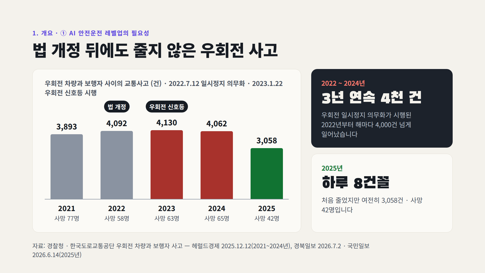

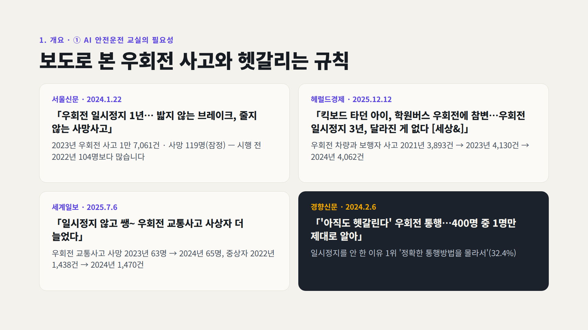

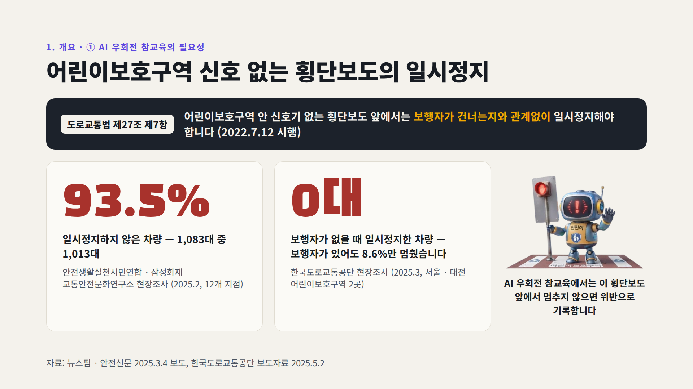

### ② 우회전 · 어린이보호구역에 AI가 필요한 이유

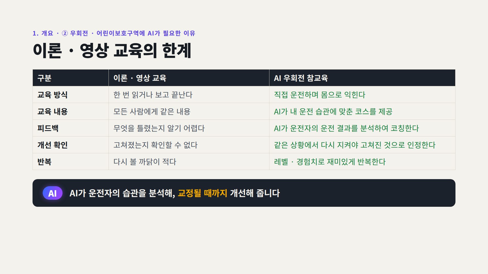

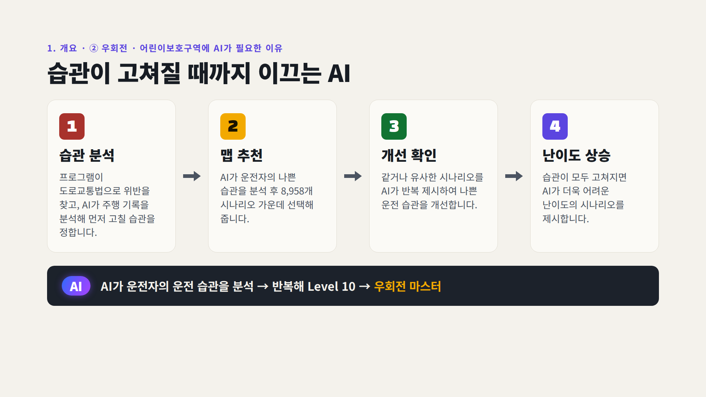

---

## 2. AI 우회전 참교육 내용

### ① 주요 기능 8가지

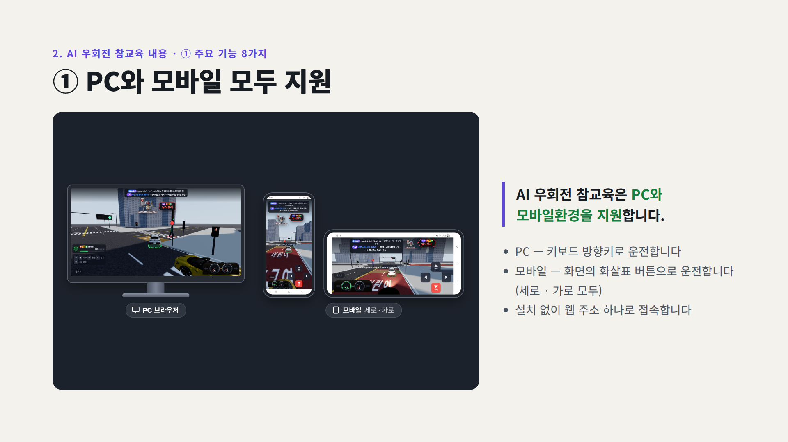

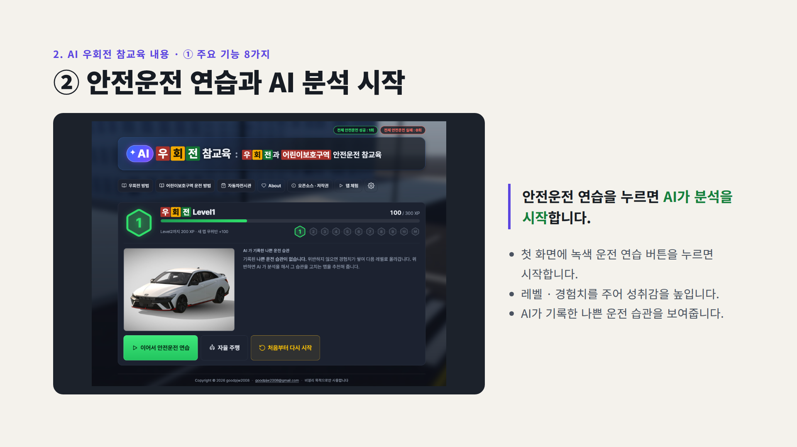

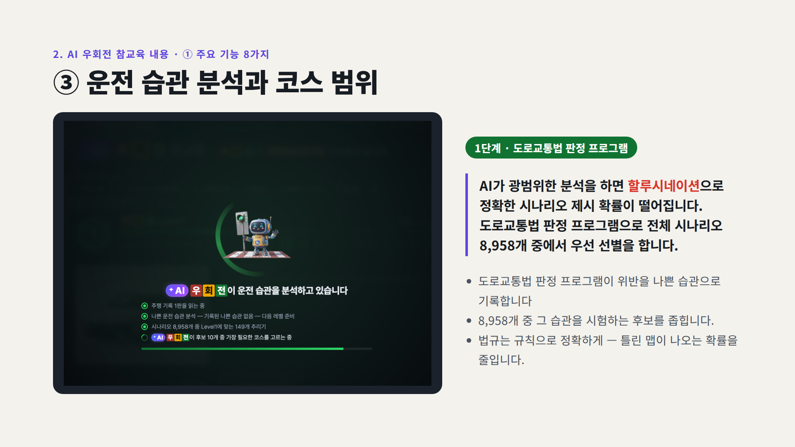

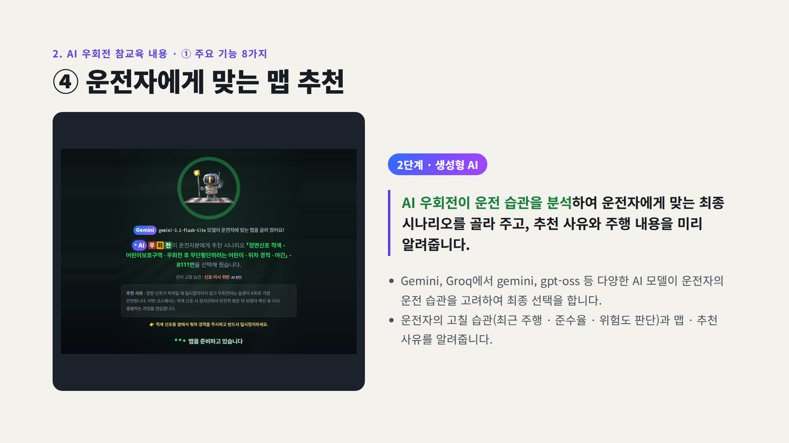

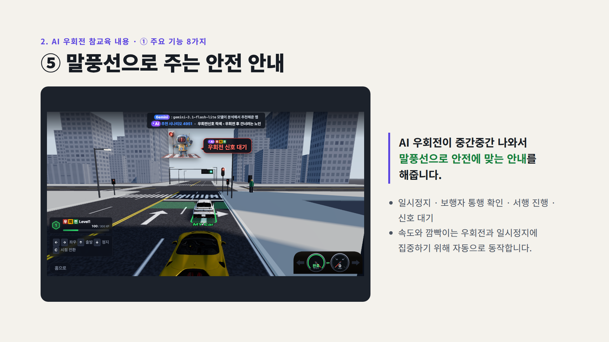

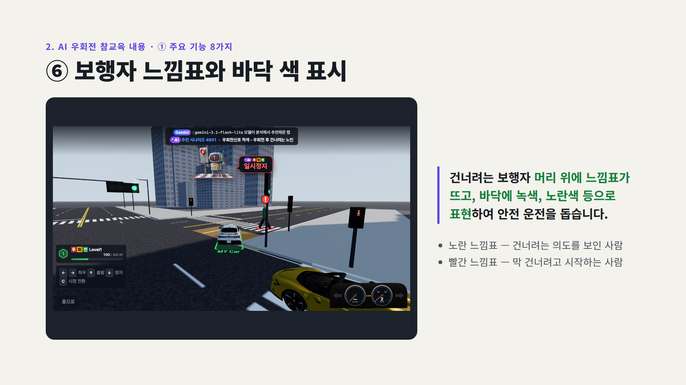

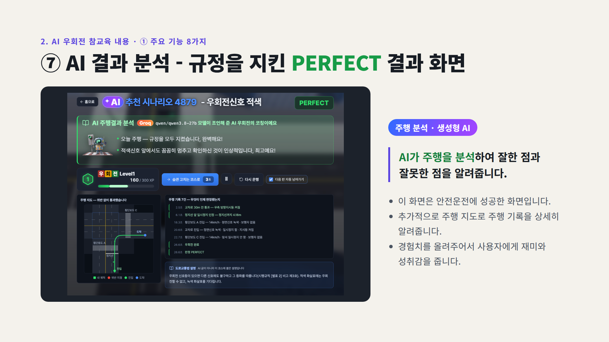

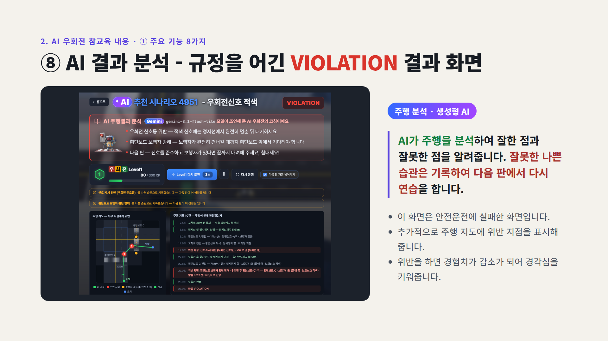

### ② 우회전 방법 · 어린이보호구역 운전 방법

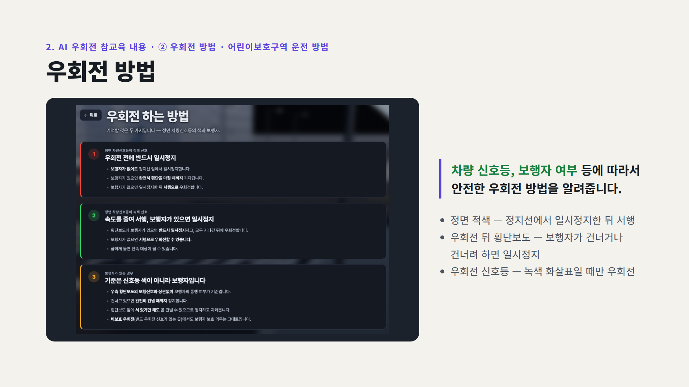

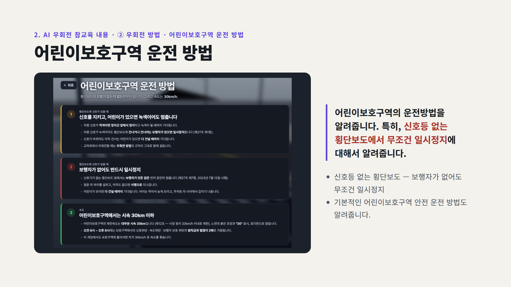

---

## 3. AI 우회전 참교육 활용

### ① 온라인 - 전국민 생활형 안전운전 연습

### ② 오프라인 - 실습하며 배우는 안전운전 교육

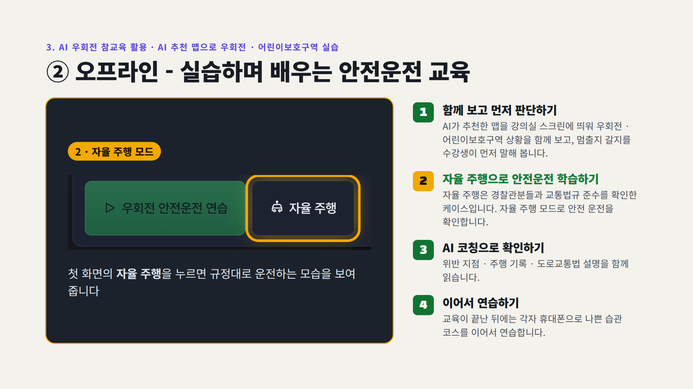

---

## 4. 기대효과

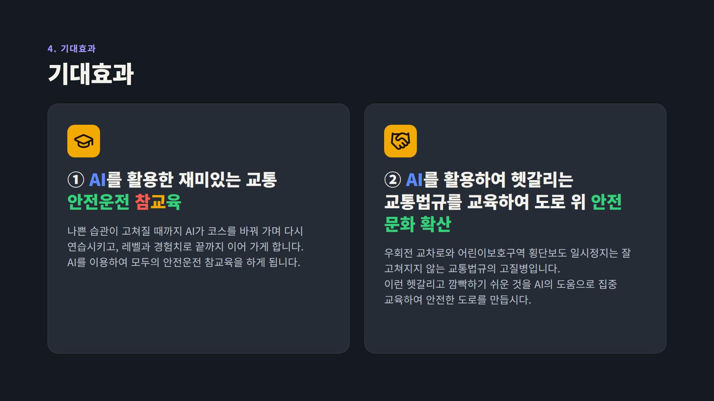

---

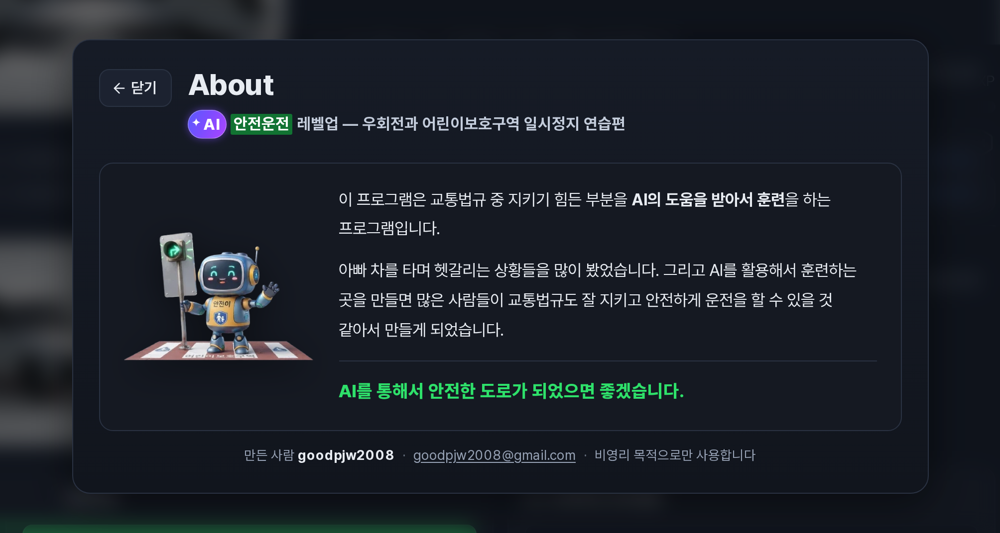

※ 라이선스 — © 2026 goodpjw2008

| 자산 | 라이선스 |
|---|---|
| 자체 작성 코드 | [**MIT License**](LICENSE) |
| 로봇 캐릭터 '안전이' 그림(Google Gemini로 생성) · README 글과 그림 | [**CC BY 4.0**](LICENSE-ASSETS) |
| 3D 자동차 모델 9종 · 전시관 차 사진 | 원작자 라이선스 — CC BY 4.0 · CC BY-NC 4.0 · CC BY-NC-SA 4.0 |
| 효과음 · 환경광(HDRI) | CC0 1.0 |
| 글꼴 Pretendard · 아이콘 Lucide · three.js | SIL OFL 1.1 · ISC · MIT |

다만 3D 자동차 모델 중 4종(아반떼 N · M8 · M5 · SL63)이 비영리(NC) 조건이라, 이 모델이 들어 있는 배포 사이트는 비영리로만 운영합니다. 모델별 출처와 수정 사항은 [THIRD_PARTY_NOTICES.md](THIRD_PARTY_NOTICES.md)를 참고하시기 바랍니다.
