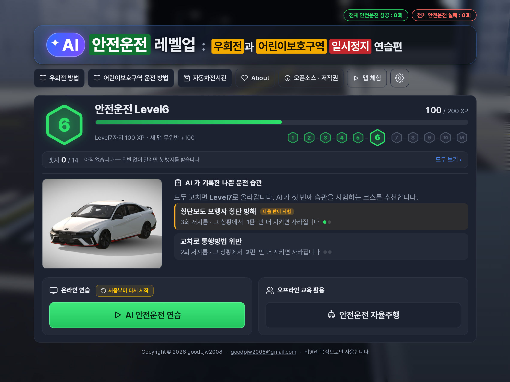
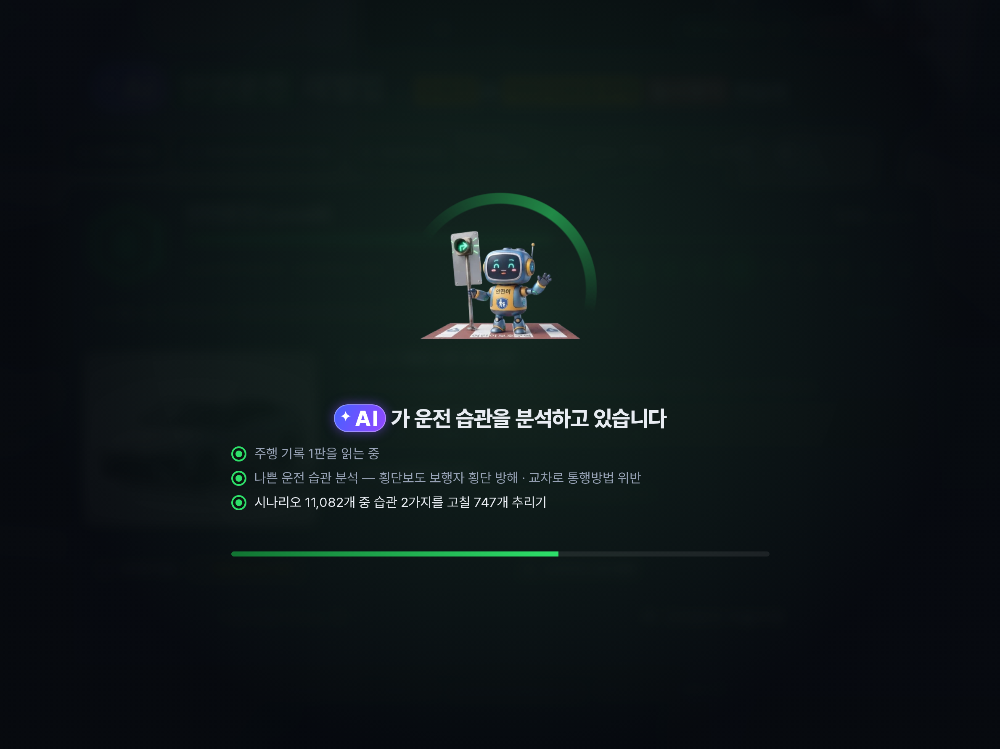
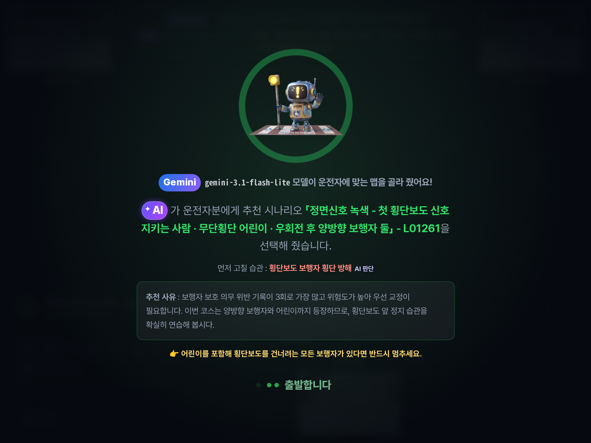
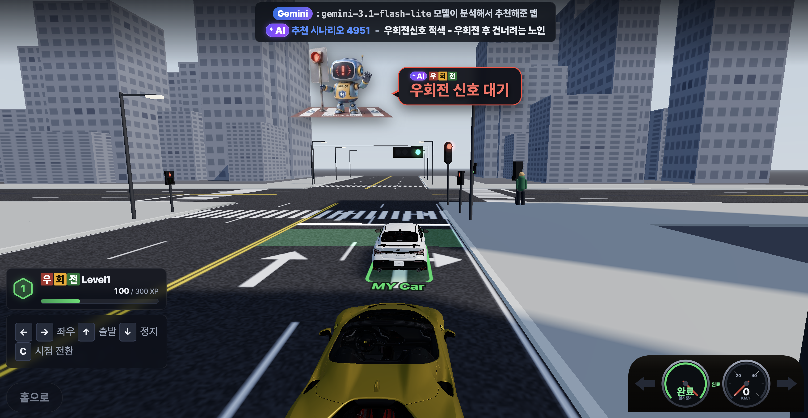
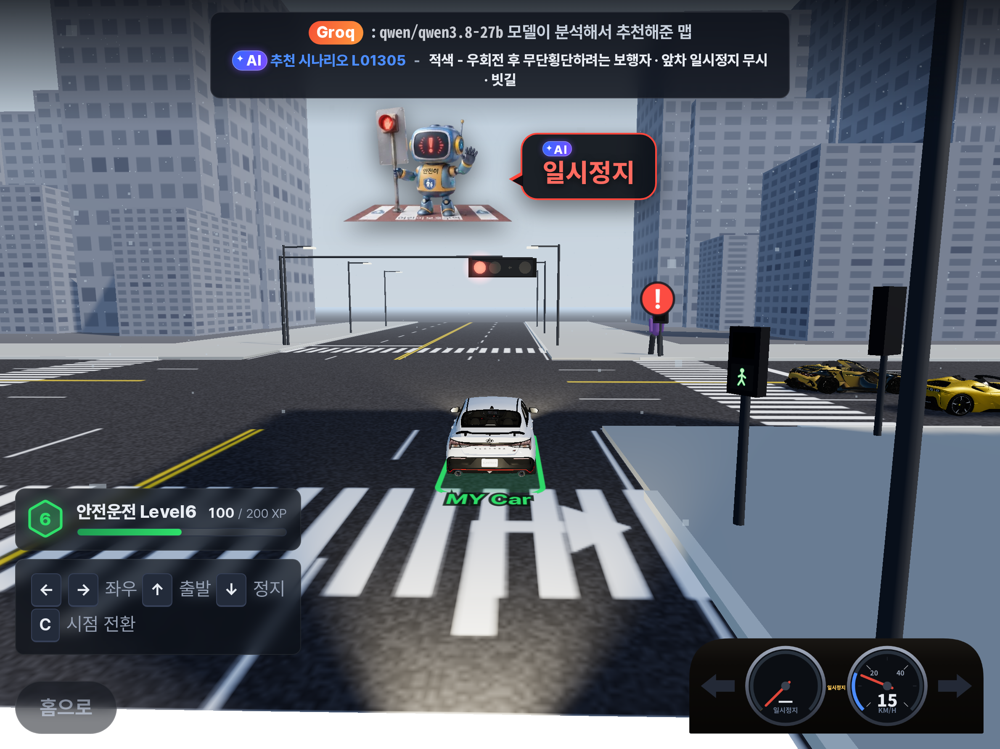
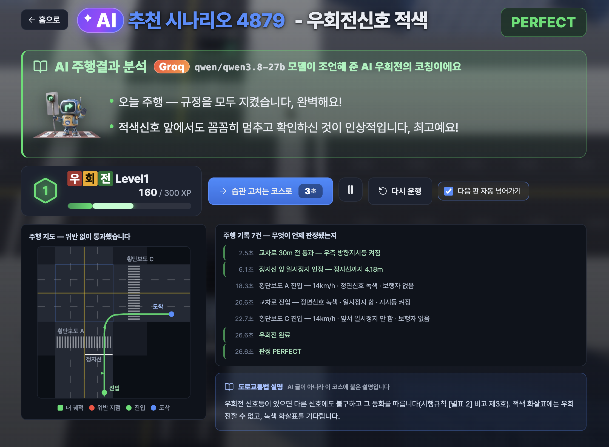
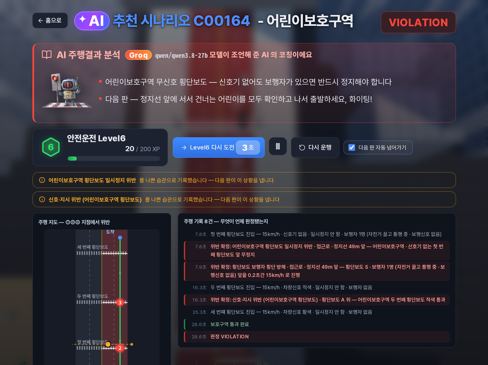
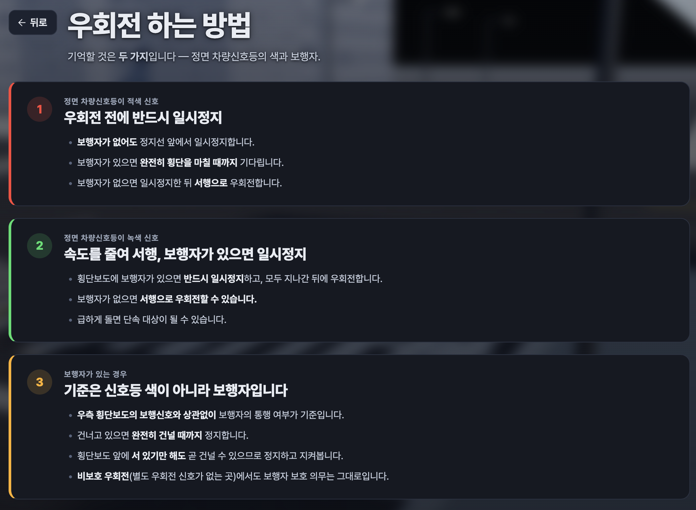
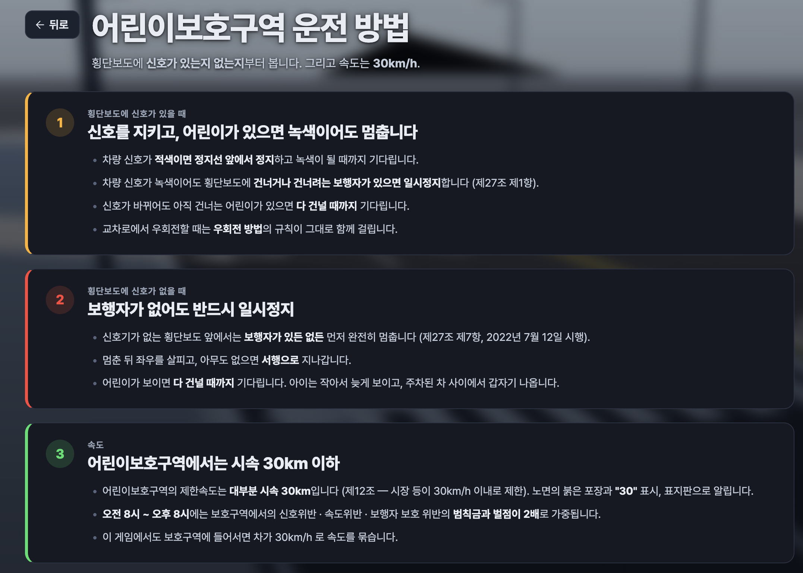

<h1>
  <picture>
    <source media="(prefers-color-scheme: dark)" srcset="docs/title-dark.png">
    
  </picture>
</h1>

이 프로그램은 교통법규 중 지키기 힘든 부분을 AI의 도움을 받아서 훈련을 하는 프로그램입니다.

아빠 차를 타며 헷갈리는 상황들을 많이 봤었습니다. 그리고 AI를 활용해서 훈련하는 곳을 만들면 많은 사람들이 교통법규도 잘 지키고 안전하게 운전을 할 수 있을 것 같아서 만들게 되었습니다.

AI를 통해서 안전한 도로가 되었으면 좋겠습니다.

첫 화면에서 레벨과 경험치, AI가 기록한 나쁜 운전 습관, 전체 안전운전 성공·실패 횟수를 한눈에 봅니다.

AI 우회전이 주행 기록과 나쁜 운전 습관을 분석해 8,958개 시나리오 중 지금 레벨에 맞는 코스를 추립니다.

AI가 운전자에게 맞는 맵을 골라 주고, 추천 사유와 주행하며 볼 것을 알려 줍니다.

우회전 신호등이 적색이면 AI 우회전이 말풍선으로 "우회전 신호 대기"를 알려 줍니다.

건너려는 보행자 머리 위에 느낌표가 뜨고, AI 우회전이 일시정지를 알려 줍니다.

규정을 모두 지키면 PERFECT — AI가 잘한 점을 짚어 주고, 주행 지도와 초 단위 판정 기록을 보여 줍니다.

위반하면 AI가 무엇을 고쳐야 하는지 코칭하고, 그 위반을 나쁜 습관으로 기록해 다음 판에서 다시 연습하게 합니다.

우회전 방법 — 정면 신호등의 색과 보행자에 따라 어떻게 우회전해야 하는지 정리했습니다.

어린이보호구역 운전 방법 — 횡단보도에 신호가 있을 때와 없을 때, 그리고 시속 30km 규칙을 정리했습니다.

이 프로그램을 만든 이유를 담은 About 화면입니다.
